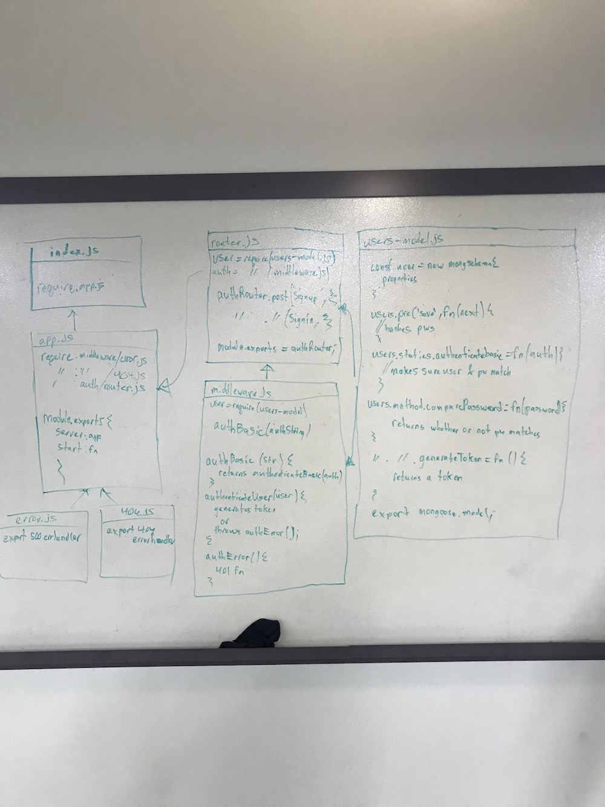
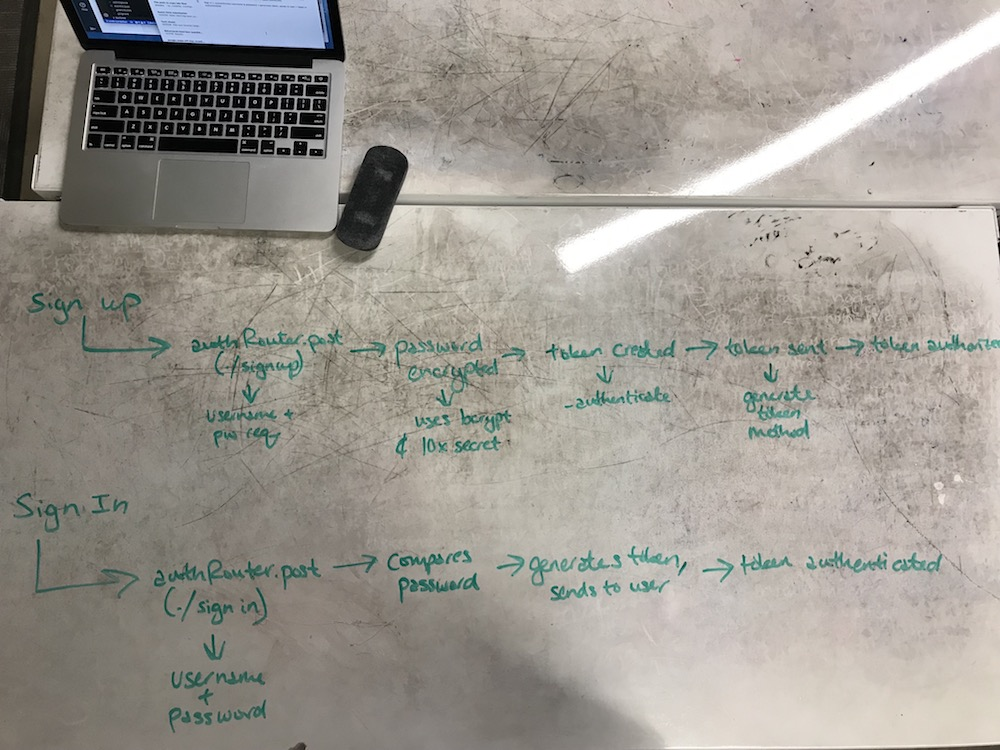

 LAB
=================================================

## Authentication

### Author: Becca Lee and Jacob Anderson

### Links and Resources

* [repo](https://github.com/beccalee123/16-authentication)
* [travis](https://www.travis-ci.com/beccalee123/16-authentication)
* [heroku](https://bl-ja-authentication.herokuapp.com/)

### Modules
- `src/auth/middleware.js` contains middleware functions for authentication
- `src/auth/router.js` contains post routes for signup and signin
- `src/auth/users-model.js` contains user schema, password hashing functions, token generation functions, and authentication
- `src/middleware/404.js` contains the 404 error handler
- `src/middleware/error.js` contains 500 error handling
- `src/routes/books.js` contains the books routes
- `src/app.js` contains server starting functions and app.use info
- `index.js` sets up the server

### Setup
#### `.env` requirements
* `PORT` - 3000
* `MONGODB_URI` - mongodb://localhost:27017/store

#### Running the app
* Open up two terminal windows, in one, run `nodemon`
* In the other...
  * To sign up, enter `echo '{"username":"<"your username">, "password":<"your password">, "role":"user"}' | http post :3000/signin
  * To sign in, enter http post :3000/signin -a yourusername:yourpassword
`
  
#### Tests
* How do you run tests?
* What assertions were made?
* What assertions need to be / should be made?
Tests were provided in the source code to ensure all server and route functionality is fully operational

#### UML

